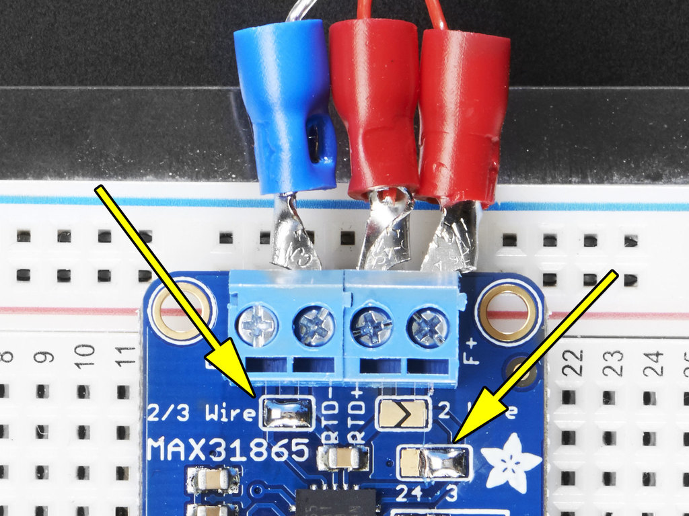
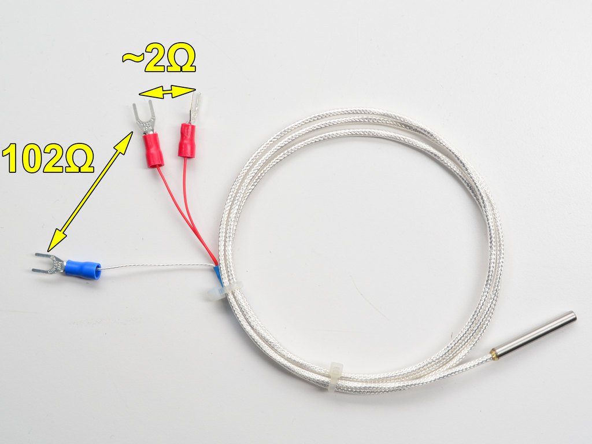

 
 

<h1>  Slogan  <b> </b>  Experiment  <b> </b>  Developer  <b> </b>  Formula  <b> </b>  Contact  </h1>
# Slogan
<b>  From "bore" plot to "bode" plot  </b>

    <b><a href="#top">↥ back to top</a></b>

 

# Experiment
<b>  PID controller using temperature sensor as a feedback  </b>

    <b><a href="#top">↥ back to top</a></b>

 

## Developer
<b> All developers are from K.J. Somaiya College of engineering </b>
<b>   <a href = "https://www.google.com/url?sa=t&rct=j&q=&esrc=s&source=web&cd=1&cad=rja&uact=8&ved=2ahUKEwimkNWI36fgAhWKwI8KHU2sDdQQFjAAegQIGBAB&url=https%3A%2F%2Fkjsce.somaiya.edu%2Fkjsce%3F%2Fkjsce&usg=AOvVaw3-wuz9mgsOCLkBQXvM_6U4"> Click the link of the college website</b>  </a>

<b> A. Aditya Panchal | <b> B. Amogh Joshi| <b>  C. Soofiyan Atar </b> |<b> D. Gopal Sonune <b>
:--|:--|:-:|:-:
 |  | |
 IT department(student) |  Etrx department(student) |  Extc department(student) |  Comps department(professor)

    <b><a href="#top">↥ back to top</a></b>

 

## Formula
<b> PID controller</b>

 <b>

 kp is the proportional gain 
 ki is the integrating gain 
 kd is the diffrentiating gain 
 e(t) is the error term  

    <b><a href="#top">↥ back to top</a></b>

 

## Contact
<b> Name | <b> Faculty/Student |<b>  Phone | <b> Email </b>
:--|:--|:-:|:--|:-:
Gopal Sonune | Faculty | +91 9702372735 | gopal.s@somaiya.edu
Amogh Joshi | Student | +91 9819012516 | amogh.joshi@somaiya.edu
Soofiyan Atar | Student | +91 8425932900 | soofiyan.a@somaiya.edu
Aditya Panchal | Student | +91 9619840377 | panchal.ah@somaiya.edu

    <b><a href="#top">↥ back to top</a></b>

 

